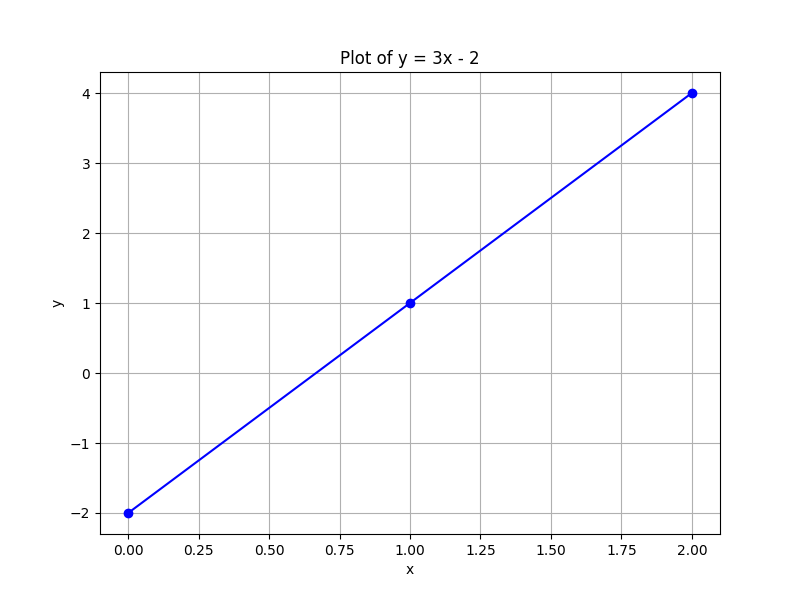

# Table of Contents

1.  [matematica para principiantes](#org83fb998)
    1.  [Modelos Funcionales](#org72415a7)
    2.  [Modelos lineales](#org8967ba3)

-   **tags:** [matematica](matematica.md)

-   Como generar bloques de codigo en [emacs](20230318192052-emacs.md) para [matematica](matematica.md) <https://acaird.github.io/2015/09/04/plots-from-org-mode-tables>

# [matematica](matematica.md) para principiantes

## Modelos Funcionales

-   ¿Qué es una función?: Es una **relación** entre dos o más variables, cada una de estas definida dentro de un conjunto determinado. Con la condición de que para cada valor de la variable de entrada le corresponda uno y solo uno de salida
-   [Funciones, relaciones y conjuntos](https://youtu.be/Ll7xfe3HoZE)
    -   **Relación:** Correspondncia entre elementos de dos conjuntos. La formulación de una exporesión que uno dos o más elementos entre si
    -   **Función:** Una relación en los que a cada valor de la variable independiente le corresponde un UNICO valor de la varible dependiente
    -   **$f(x)$:** La funcion que le vamos a a hacer a la $x$
    -   $f(x)$ = $y$

-   [Representación de las funciones](https://youtu.be/A7OrJ8IlIeE)
-   [Dominio y rango de la función](https://youtu.be/H40lcwlgPMk)
    -   **Dominio:** Números comprendidos por la variable independiente
    
    -   **Rango:** Números comprendidos por la variable dependiente

## Modelos lineales

-   <https://youtu.be/AoZpzAoC1Qg>
-   La ecuación lineal siempre tienen las variables elevadas a la 1
-   $y = 3x-2$
    
    <table border="2" cellspacing="0" cellpadding="6" rules="groups" frame="hsides">
    
    
    <colgroup>
    <col  class="org-left" />
    
    <col  class="org-right" />
    
    <col  class="org-right" />
    
    <col  class="org-right" />
    </colgroup>
    <tbody>
    <tr>
    <td class="org-left">x</td>
    <td class="org-right">0</td>
    <td class="org-right">1</td>
    <td class="org-right">2</td>
    </tr>
    
    
    <tr>
    <td class="org-left">y</td>
    <td class="org-right">-2</td>
    <td class="org-right">1</td>
    <td class="org-right">4</td>
    </tr>
    </tbody>
    </table>

    import matplotlib.pyplot as plt
    
    
    # Define the data
    x = [0, 1, 2]
    y = [-2, 1, 4]
    
    # Plot the data
    plt.figure(figsize=(8, 6))
    plt.plot(x, y, marker='o', linestyle='-', color='b')
    
    # Add title and labels
    plt.title('Plot of y = 3x - 2')
    plt.xlabel('x')
    plt.ylabel('y')
    
    # Show grid
    plt.grid(True)
    
    # Save the plot as a PNG file
    plt.savefig('modelos_lineales.png')
    
    # Display the plot in a way that Org mode can capture
    plt.close()  # This ensures the figure is closed after saving and before Org tries to display it
    return('modelos_lineales.png')

